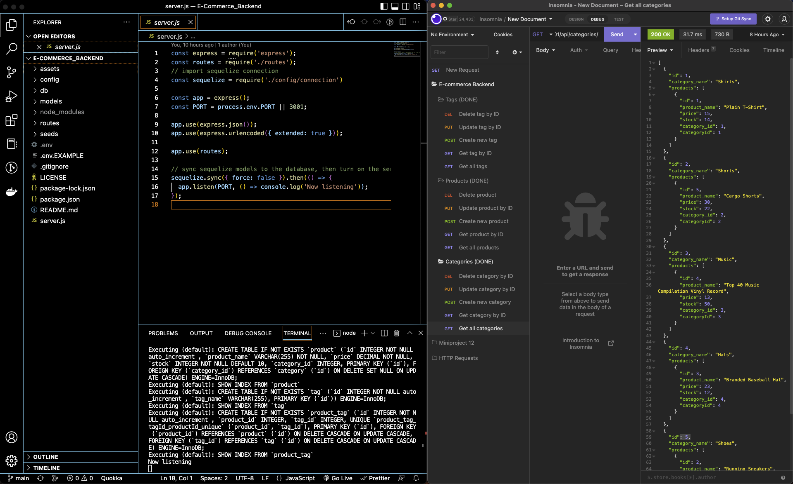

# E-Commerce Backend

## Description

A simple backend using sequelize, express, and node to handle database access and control for an e-commerce site (geared around products, tags, categories, etc.). Use of an API testing platform (like Insomnia) is recommended for use.

## Table of Contents

- [Installation](#installation)
- [Usage](#usage)
- [Tests](#tests)
- [Contributing](#contributing)
- [Questions](#questions)
- [License](#license)

## Installation

Run "npm i" in the project directory after cloning. Edit the .env.EXAMPLE file to strip off the dummy suffix and add your own db credentials. Load the mysql db schema (in ./db) and seed the db using "npm run seed".

## Usage

Run "node server" in the project directory. Interact with the backend using tools such as Insomnia to test routes (such as localhost:3001/api/products/) and utilize the db functionality.

Youtube demonstration video: https://youtu.be/g3VAQU-lCBA

## Tests

No tests implemented at this time.

## Contributing

Not accepting contributions at this time, but feel free to clone, fork, and use as you wish.

## Questions

[Github: Gordon-Magill](https://github.com/Gordon-Magill) 
Email: gordon.magill@gmail.com
Please reach out via provided email for any questions.

## License

Licensed under [MIT](https://opensource.org/licenses/MIT).